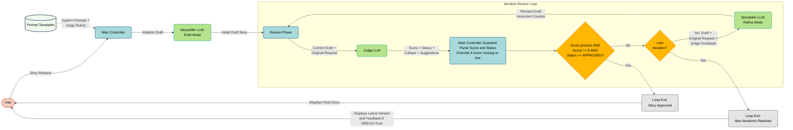

# System Architecture

This diagram illustrates the flow of prompts and the interaction between the Judge, Storyteller, User, and the Main Controller in our system.

```mermaid
flowchart LR
    %% Define color classes for visual clarity
    classDef user fill:#f9d0c4,stroke:#e07a5f,stroke-width:2px,color:#000,rx:10,ry:10
    classDef main fill:#a8dadc,stroke:#457b9d,stroke-width:2px,color:#000,rx:5,ry:5
    classDef agent fill:#b5e48c,stroke:#52b69a,stroke-width:2px,color:#000,rx:5,ry:5
    classDef data fill:#f1faee,stroke:#1d3557,stroke-width:2px,color:#000
    classDef decision fill:#ffb703,stroke:#fb8500,stroke-width:2px,color:#000
    classDef terminal fill:#e5e5e5,stroke:#9a8c98,stroke-width:2px,color:#000,rx:5,ry:5

    User([User]):::user --->|Story Request| Main[Main Controller]:::main
    Templates[(Prompt Templates)]:::data -.->|"System Prompts +<br/>Judge Rubric"| Main

    Main --->|Initialize Draft| StorytellerDraft[Storyteller LLM:<br/>Draft Mode]:::agent
    StorytellerDraft --->|Initial Draft Story| LoopStart

    subgraph Iterative Review Loop
        LoopStart[Review Phase]:::main --->|"Current Draft +<br/>Original Request"| Judge[Judge LLM]:::agent

        Judge --->|"Score + Status +<br/>Critique + Suggestions"| Guardrail[Main Controller Guardrail:<br/>Parse Score and Status<br/>Override if score missing or low]:::main

        Guardrail ---> Decision{"Score present AND<br/>Score >= 8 AND<br/>Status == APPROVED?"}:::decision

        Decision --->|No| MaxCheck{Last<br/>Iteration?}:::decision

        MaxCheck --->|"No: Draft +<br/>Original Request +<br/>Judge Feedback"| StorytellerRefine[Storyteller LLM:<br/>Refine Mode]:::agent
        StorytellerRefine --->|Revised Draft<br/>Increment Counter| LoopStart
    end

    MaxCheck --->|Yes| MaxLimit[Loop Exit:<br/>Max Iterations Reached]:::terminal
    Decision --->|Yes| Approved[Loop Exit:<br/>Story Approved]:::terminal

    MaxLimit --->|"Displays Latest Version<br/>and Feedback if DEBUG=True"| User
    Approved --->|Displays Final Story| User
```
